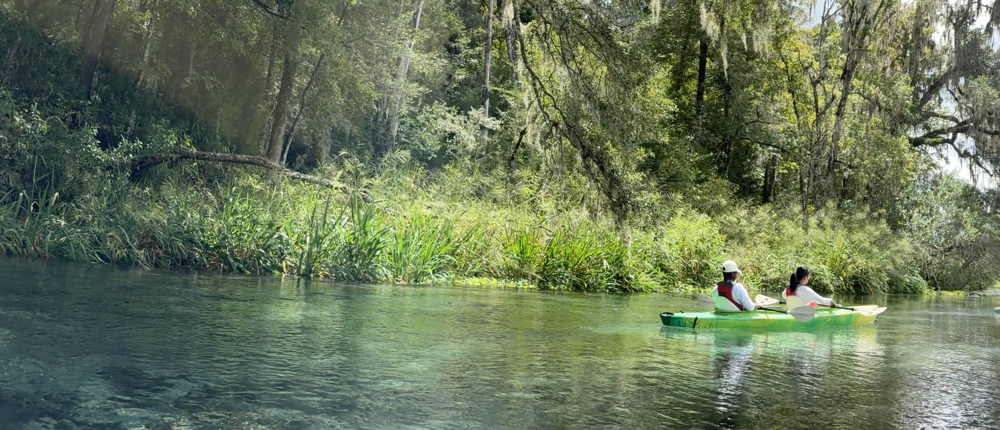

<b>

# Hi, I'm Jade Xu!
🎓 Senior at University of Florida, studying Computer Science with a minor in Mathematics  
🔭 Aspiring Data Scientist/Machine Learning Engineer and Sustainability Enthusiast </b>

I'm a data enthusiast who loves bringing geographic and environmental insights to life through visualizations. As president of my university's hiking club, I combine my passion for nature and sustainability with analytical skills—using math-driven approaches to optimize data analysis and build machine learning models. Whether I'm exploring trails or exploring datasets, I'm always looking for patterns that tell compelling stories about our world.

## 🛠 Tech Stack:  
Languages: Python, C++, SQL, MATLAB, Julia, R, Java, HTML, CSS, JS  
Frameworks & Libraries: React, Numpy, Pandas, scikit-learn, TensorFlow  
Tools & Technology: Git, Docker, Agile, ArcGIS Pro, ArcGIS Online, Google Earth Pro, QGIS, Excel  
Certificates: Machine Learning Foundations, Fundamentals of Deep Learning, Building Models for GIS Analysis Using ArcGIS
 

## 📫 How to Reach Me:
[LinkedIn](https://www.linkedin.com/in/jiayi-jade-xu/)
 

Fun Fact:
I love painting birds!
